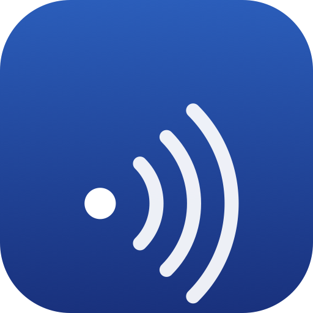

<div align="center">



# MacConnect

An open-source KDE Connect client for macOS. Pair your Android, Linux, or Windows devices with your Mac over the local network to share files, clipboard, notifications, media controls, and battery status.

[](https://github.com/AlanHuang99/MacConnect/actions/workflows/ci.yml)
[](LICENSE)
[](https://github.com/AlanHuang99/MacConnect/releases/latest)
[](https://github.com/AlanHuang99/MacConnect/releases/latest)

</div>

MacConnect lives in the menu bar and speaks the KDE Connect LAN protocol (version 7), so it interoperates with KDE Connect on Android, Linux, and Windows, and with the KDE Connect iOS app. Everything runs peer-to-peer over TLS on your local network: there is no cloud relay, account, or telemetry.

## Features

- **Discovery and pairing** — finds peers over UDP broadcast and mDNS/Bonjour, then pairs over mutual TLS with trust-on-first-use and per-device certificate pinning. Pairing is confirmed with Accept/Reject prompts on both sides, and a changed peer certificate raises a "Reset Trust" prompt instead of failing silently.
- **File transfer** — send from the popover, by drag-and-drop onto a device row, or from Finder's right-click → Services → "Send via MacConnect". Incoming files land in `~/Downloads`; active transfers show an inline progress bar and the last 20 are listed in Settings.
- **Clipboard** — push the Mac clipboard to a device and auto-apply incoming clipboard, with an image fallback that sends the pasteboard image as a file.
- **Notifications** — Android notifications appear as macOS banners, with inline reply where the notification supports it.
- **Android-to-Mac media control (MPRIS)** — KDE Connect Android can control the Mac's active system media session with Play, Pause, Previous, and Next. Its Multimedia control also provides synchronized Mac output volume and mute. Play/Pause reflects the actual Mac playback state, keeping the control icon synchronized; the Mac popover has no phone-media tile. The existing Android cover surface shows current-track artwork when macOS makes artwork bytes available, and otherwise keeps its normal placeholder.
- **Battery** — the peer's charge level and charging state on the device row.
- **Find My Phone** — ring a paired device from its menu.
- **Per-plugin control** — enable or disable each plugin globally or per device.
- **Launch at login**, SHA-256 fingerprint display for out-of-band verification, and an editable broadcast name.

MacConnect deliberately stays on the local network: connections are user-initiated and peer-to-peer, and the app ships no analytics. It does not relay traffic through any server.

## Requirements

- macOS 13 (Ventura) or later. The release binary is universal (Apple Silicon and Intel).
- A device on the same local network running KDE Connect (Android, Linux, or Windows) or the KDE Connect iOS app.

## Install

Download the latest `.dmg` from [Releases](https://github.com/AlanHuang99/MacConnect/releases/latest), open it, and drag **MacConnect.app** to Applications. The build is signed with an Apple Developer ID and notarized, so it launches without a Gatekeeper warning. A `.zip` of the app bundle is published alongside the DMG.

The direct build updates itself in-app through [Sparkle](https://sparkle-project.org) (Settings → "Check for Updates…", with an optional automatic check); each download is verified with an EdDSA signature before installing.

## Build from source

Prerequisites: macOS 13+, Xcode 15+ (or the Command Line Tools — note that `swift test` needs Xcode, which ships XCTest). `/usr/bin/openssl` (present on stock macOS) generates the local TLS identity on first launch.

```bash
git clone https://github.com/AlanHuang99/MacConnect.git
cd MacConnect

# Develop
swift build              # debug build
swift run macconnect     # run without a bundle (no menu-bar item)
swift test               # unit tests
xed Package.swift        # open in Xcode

# Assemble a .app bundle and launch it
./scripts/build-app.sh release
open build/MacConnect.app
```

Assembling the release bundle locally needs no signing secrets. On first launch the app writes an RSA-2048 self-signed certificate and a stable device ID to `~/Library/Application Support/MacConnect/`; trusted-peer certificates are stored alongside as DER files keyed by remote `deviceId`.

## How it works

MacConnect implements KDE Connect protocol version 7:

- **Discovery** — subnet-directed UDP broadcasts on every active IPv4 interface (plus the limited broadcast `255.255.255.255`) and mDNS/Bonjour (`_kdeconnect._udp`), so peers are found even where access points filter limited broadcast.
- **Transport** — a newline-framed plain-TCP identity exchange upgrades to mutual TLS on the same channel; per the protocol, the side that initiated the TCP connection becomes the TLS server. Certificates are pinned per `deviceId` after the first pairing.
- **Liveness** — TCP keepalive (`SO_KEEPALIVE` plus the Darwin `TCP_KEEPALIVE`/`KEEPINTVL`/`KEEPCNT` family) detects a dead socket in about 60 seconds, and discovery rebuilds on sleep/wake and network changes so peers reconnect without an app restart.
- **File transfer** — payloads move over a second TLS connection on a port the sender advertises in the share packet.

Protocol references: [KDE Connect Android](https://invent.kde.org/network/kdeconnect-android) (the canonical implementation), [KDE Connect iOS](https://invent.kde.org/network/kdeconnect-ios), and the [Valent protocol notes](https://valent.andyholmes.ca/documentation/protocol.html).

## Tech stack

| Area | Choice |
|------|--------|
| Language / UI | Swift, AppKit (menu-bar shell), SwiftUI (popover) |
| Networking | [SwiftNIO](https://github.com/apple/swift-nio) and [NIOSSL](https://github.com/apple/swift-nio-ssl) for the TCP/TLS link |
| Discovery | Network.framework (`NWListener` / `NWBrowser`) and BSD sockets for UDP broadcast |
| TLS identity | `/usr/bin/openssl` for first-launch cert generation; per-device DER pinning |
| In-app updates | [Sparkle](https://sparkle-project.org) (direct build only) |
| Minimum target | macOS 13 |

## Project layout

```
Sources/
  MacConnectCore/
    Logging.swift              # os.Logger subsystems
    Settings/                  # device id, name, trusted-device store, per-plugin + per-device overrides
    Packet/                    # NetworkPacket, IdentityPayload, PairPacketBuilder, PacketType
    Network/
      LanLinkProvider.swift    # UDP discovery + TCP listener + outbound dial
      LanLink.swift            # per-device link wrapper over the TCP channel
      KDEConnectChannelHandler.swift
                               # plain-TCP identity then mTLS upgrade, idle-state close, readBuffer caps
      NIOTransport.swift       # event-loop group + bootstraps + SO_KEEPALIVE/TCP_KEEPALIVE family
      PayloadTransport.swift   # second-channel file transfer; receive-side serial queue + autoRead backpressure
      TLSContextBuilder.swift  # NIOSSL config + per-deviceId pinning verifier
      CertificateService.swift # local cert + pinned-peer store
      NetworkInterfaces.swift  # getifaddrs broadcast enumeration
    Device/                    # Device, DeviceManager
    Plugin/                    # Plugin protocol, registry, plugin implementations, TransferStore, BatteryStore
  MacConnectApp/
    Resources/Localizable.xcstrings  # en baseline; SwiftPM-processed
    *.swift                          # menu-bar executable (AppKit + SwiftUI popover)
Tests/MacConnectCoreTests/     # XCTest: packet round-trips, pair timestamp, PeerVerifier, EmbeddedChannel handler, liveness
scripts/build-app.sh           # assembles MacConnect.app; embeds Sparkle for the direct channel
scripts/sign-app.sh            # Developer ID codesign, signing embedded Sparkle inside-out first
.github/workflows/             # CI (build+test, lint) and release (sign, notarize, appcast)
```

## Releases

Releases are tagged `vX.Y.Z`. Pushing a tag triggers [`.github/workflows/release.yml`](.github/workflows/release.yml), which builds the universal direct binary (with Sparkle), signs it with Apple Developer ID and Hardened Runtime (Sparkle's nested helpers signed inside-out), notarizes and staples it, packages a `.zip` and a drag-to-Applications `.dmg`, publishes a GitHub Release with both assets, and refreshes the Sparkle appcast on GitHub Pages.

```bash
git tag v0.3.6
git push origin v0.3.6
```

## Distribution channels

One source tree builds two products, selected by an argument to `scripts/build-app.sh` (which sets the `MACCONNECT_SPARKLE` environment variable that `Package.swift` reads):

| Channel | Build command | Updates | Sparkle |
|---------|---------------|---------|---------|
| **Direct** (GitHub Releases) | `./scripts/build-app.sh release-universal X.Y.Z direct` | In-app, via Sparkle | linked + embedded |
| **Mac App Store** (default) | `./scripts/build-app.sh release-universal X.Y.Z` | App Store | absent |

All Sparkle code is gated behind the `SPARKLE` compile condition, set only on the direct build. The default build links no Sparkle, ships no update UI, and carries none of Sparkle's machinery, which the App Store rejects. It is the groundwork for a future App Store submission; the submission pipeline itself (sandbox entitlements, provisioning, upload) is not wired up yet.

### Auto-update key setup (maintainers)

In-app updates verify each download with an EdDSA (ed25519) key pair. Until it is configured, the release workflow still publishes the `.dmg`/`.zip`; it just skips refreshing the appcast, and `build-app.sh` warns that `SUPublicEDKey` is the placeholder.

1. Generate the key pair once with Sparkle's `generate_keys` (from the [Sparkle release bundle](https://github.com/sparkle-project/Sparkle/releases)):
   ```bash
   ./bin/generate_keys                         # stores the private key in your login keychain
   ./bin/generate_keys -x sparkle_private.key  # also export it to a file
   ```
2. Set the printed base64 **public** key as the repository variable `SPARKLE_PUBLIC_ED_KEY` (Settings → Secrets and variables → Actions → Variables). The release build bakes it into `SUPublicEDKey`. The public key is not secret.
3. Store the exported **private** key (verbatim file contents) as the repository secret `SPARKLE_ED_PRIVATE_KEY`, then delete the local file.
4. Enable GitHub Pages for the repo (serving the `gh-pages` branch). The feed lives at `https://alanhuang99.github.io/MacConnect/appcast.xml` (`SUFeedURL` in `build-app.sh`); the release workflow creates and pushes `appcast.xml` there.

The first Sparkle-enabled release cannot auto-update users already on an earlier, Sparkle-free build — they download it once from Releases, and in-app updates work from the next release onward.

## Contributing

Issues and pull requests are welcome. For anything substantial, please open an issue first to discuss the approach. CI builds and tests every push; the `.swiftformat` and `.swiftlint.yml` configs in the repo are enforced by a CI Lint job, so run them locally before pushing. See [`ROADMAP.md`](ROADMAP.md) for planned work.

## License

GPL-3.0-or-later. KDE Connect upstream is licensed GPL-2.0-only OR GPL-3.0-only OR LicenseRef-KDE-Accepted-GPL; this project chooses GPL-3.0-or-later for compatibility with the iOS port. See [`LICENSE`](LICENSE).
